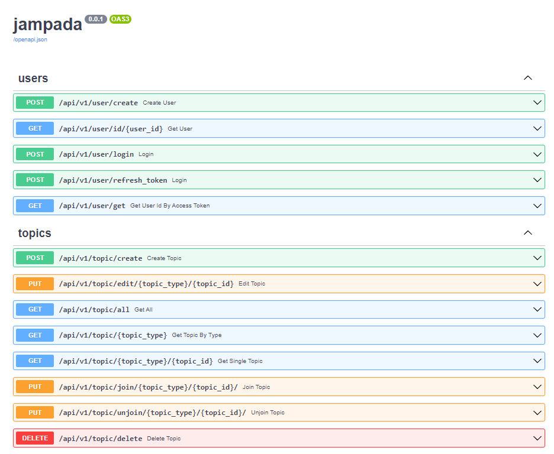

# jampada project

#### จำปาดะ

```
** Initial Project **
- 1. cd backend/
- 2. python3 -m venv backend/venv 
- 3. activate the python virtual environment
- 4. pip install poetry && poetry install
- 5. script/run-api
- 6. cd to frontend/
- 7. npm install
- 8. npm start
```

# Project Jampada : Sportifriend

## อธิบายการทำงาน

ลิงก์วิดีโอ [YouTube](https://youtu.be/tKEqlfiVa0k)

เป็น web application ที่ใช้สำหรับหาเพื่อนเล่นกีฬาภายในมหาวิทยาลัย
Front-end ใช้ React.js เป็น Framework

|Function                |   Detail                 |
|----------------|-------------------------------|
|Login    |          ลงชื่อเข้าใช้    |
|Register        |สมัครใช้งาน
|Room       |เป็นห้องที่แสดงว่ามีการจองกี่ห้อง
|Sport      |ประเภทของกีฬา
|Topic       |หัวข้อ กระทู้
|Post      |ใช้สร้างกระทู้ สามารถใส่ชื่อ ระดับความสามารถ เวลาและสถานที่นัด รายละเอียดเพิ่มเติม
|Edit    |แก้ไขกระทู้
|Join   |เข้าร่วมกีฬาที่สนใจ
|Delete   |ลบกระทู้

Back-end ใช้ FastAPI และ Database ใช้ MongoDB โดยใช้ models ของ mongoengine
|       Function       |Detail|
|----------------|-------------------------------|
|Create User| API สร้าง user
|Get User       | API แสดง User
|Login         | API login
|refresh_token    | Generate token ใหม่ขึ้นมา
|Get User Id By Access Token         |API แสดง user id โดย Access token
|Create topic       |  API สร้าง Topic
|Edit Topic     | API แก้ไข Topic
|Get All       | API แสดง Topic ทั้งหมด
|Get Topic By Type      | API แสดง Topic by type
|Get Single Topic      | API แสดง Topic 1 topic
|Join Topic       |  API สำหรับการเข้าร่วม topic
|unjoin Topic       | API สำหรับการยกเลิกการเข้าร่วม Topic
|Delete Topic       | API สำหรับลบ topic

ใช้การ hash รหัสผ่านก่อนบันทึกใน database ใช้ schema ของ bcrypt ในการ hash ใช้ access token ในการจัดการข้อมูลตามสิทธิ์ที่ได้รับการเข้าถึง และมีการ compress ข้อมูลจาก backend เมื่อมีขนาดมากกว่า 1000 bytes



--------สมาชิกในกลุ่ม-----------------

6310110197 นายธนากร พงค์ทองเมือง

6310110404 นายรวินท์ ว่องวโร

6310110533 นายสุรวุฒิ สายทองอินทร์

## Tree

-------

```jampada
├── backend
│   ├── app
│   │   ├── api
│   │   │   ├── errors
│   │   │   │   ├── http_error.py
│   │   │   │   ├── __init__.py
│   │   │   │   └── validation_error.py
│   │   │   ├── __init__.py
│   │   │   └── v1
│   │   │       ├── __init__.py
│   │   │       └── routes
│   │   │           ├── api.py
│   │   │           ├── __init__.py
│   │   │           ├── sports.py
│   │   │           ├── topics.py
│   │   │           └── users.py
│   │   ├── core
│   │   │   ├── config.py
│   │   │   ├── deps.py
│   │   │   ├── __init__.py
│   │   │   ├── logging.py
│   │   │   ├── oauth2.py
│   │   │   ├── rounding.py
│   │   │   ├── security.py
│   │   │   └── settings
│   │   │       ├── app.py
│   │   │       ├── base.py
│   │   │       ├── development.py
│   │   │       ├── __init__.py
│   │   │       ├── production.py
│   │   │       └── test.py
│   │   ├── __init__.py
│   │   ├── main.py
│   │   ├── models
│   │   │   ├── __init__.py
│   │   │   ├── sports.py
│   │   │   ├── topics.py
│   │   │   └── users.py
│   │   ├── schemas
│   │   │   ├── __init__.py
│   │   │   ├── items.py
│   │   │   ├── sports.py
│   │   │   ├── tokens.py
│   │   │   ├── topics.py
│   │   │   └── users.py
│   │   └── static
│   │       └── images
│   │           └── images.jpg
│   ├── docker-compose.yml
│   ├── Dockerfile
│   ├── jampada.conf.sample
│   ├── poetry.lock
│   ├── pyproject.toml
│   └── scripts
│       ├── run-api
│       └── run-api-win.ps1
├── frontend
│   ├── package.json
│   ├── package-lock.json
│   ├── public
│   │   ├── favicon.ico
│   │   ├── index.html
│   │   ├── logo192.png
│   │   ├── logo512.png
│   │   ├── manifest.json
│   │   └── robots.txt
│   ├── README.md
│   └── src
│       ├── App.css
│       ├── App.js
│       ├── App.test.js
│       ├── component
│       │   ├── Input.js
│       │   ├── Login.js
│       │   ├── Modal.js
│       │   ├── Room.css
│       │   ├── Room.js
│       │   └── Show.js
│       ├── images
│       │   ├── bad.png
│       │   ├── bball.png
│       │   ├── fball.png
│       │   ├── log1.png
│       │   ├── log2.png
│       │   ├── pong.png
│       │   ├── psu.png
│       │   ├── ten.png
│       │   └── vball.png
│       ├── index.css
│       ├── index.js
│       ├── logo.svg
│       ├── page
│       │   ├── About.js
│       │   ├── Bad.js
│       │   ├── Bball.js
│       │   ├── Fball.js
│       │   ├── Home.css
│       │   ├── Home.js
│       │   ├── Navbar.css
│       │   ├── Navbar.js
│       │   ├── Pong.js
│       │   ├── Register.js
│       │   ├── Signin.js
│       │   ├── Ten.js
│       │   └── Vball.js
│       ├── redux
│       │   ├── actions
│       │   │   ├── authAction.js
│       │   │   └── topicAction.js
│       │   ├── reducers
│       │   │   ├── authReducer.js
│       │   │   ├── index.js
│       │   │   └── topicReducer.js
│       │   └── store.js
│       ├── reportWebVitals.js
│       ├── setupTests.js
│       └── utils
│           └── fetch.js
├── nginx
│   └── nginx.conf
├── README.md
└── scripts
    ├── run-backend.sh
    └── run-frontend.sh
```
